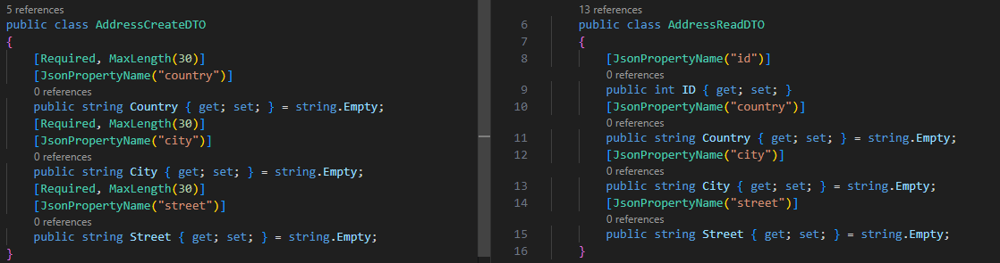
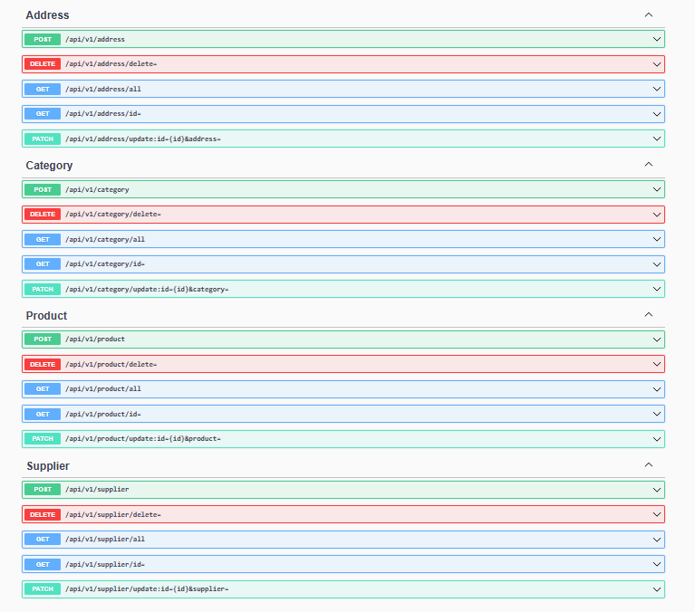
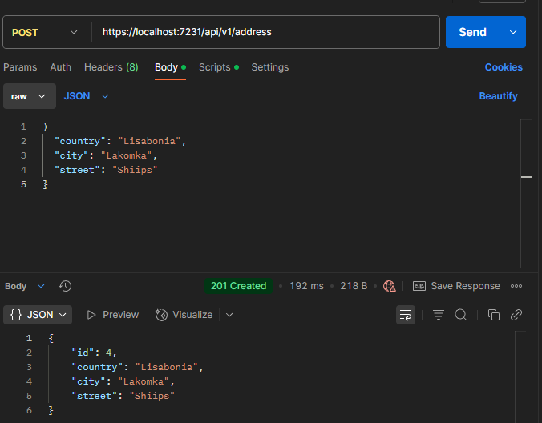
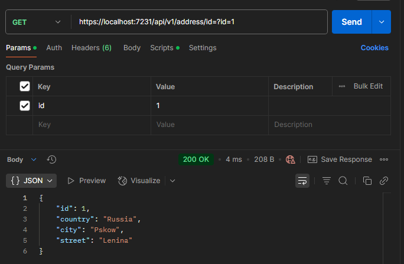
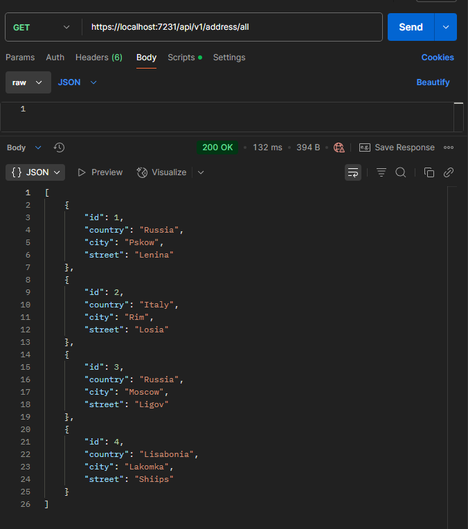
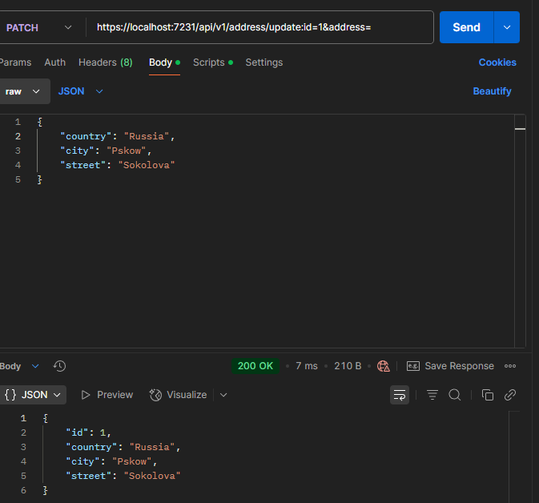

# Warehouse

# О проекте
**Стек:** ASP.NET Core Web API, InmemoryDB, Entity Framework, AutoMapper, REST Api

Проект представляет собой Web API спроектированый по RESTFUL-методологии, 
предоставляющий доступ к такой информации как продукты, поставщики, категории товаров и адресса поставщиков. 

В качетсве базы данных использовался InmemoryDB и доступ к ней через Entity Framework. Выбрана InmemoryDB, для простоты тестирования и при разработке. Очевидный минус, что при каждом запуске база данных будет очищаться. Для этого добавлен файл автозаполнения. Так же не все методы LINQ для EF работают в InmemoryDB, такие как **ExecuteUpdate()** или **ExecuteDelete()** , пришлось делать по старинке и сохранять состояния.

Для правильного доступа к данным в реализации использовались паттерны Data Access Object (DAO) и Data Transfer Object (DTO), в качестве прослойки между БД и контроллерами использовались сервисы.

Пример DTO:



Такой подход позволяет разделить данные которые мы хотим получить от пользователя и те которые мы хотим отдать ему.


Имеются следующие сущности:
```
// Товар
product
{
    id
    name
    category
    price
    available_stock // число закупленных экземпляров товара
    last_update_date // дата последней закупки
    valid_untile // срок годности
    supplier_id
}
```
```
// Поставщики
supplier
{
    id
    name
    address_id
    phone_number
}
```

```
// Адреса

address 
{
    id
    country
    city
    street
}

```
```
// Категории

address 
{
    id
    name
}

```

Была попытка реализовать правильную архитектуру приложения, но не уверен, что это вышло.Что по мне минус, который в дальнейшем может сказаться на расширяемости приложения. Так как уже в конце я понял, что и файл README и прилежащие к нему файлы будут находится в корне проекта =), что как по мне не есть хорошо.  Но времени было мало, есть как есть.


Реализованы HTTP-запросы (GET, POST, PUT, DELETE, PATCH).

- Для всех реализованы:
    
    1) Добавление
    2) Удаление
    3) Получение по ID
    4) Получение всех сущностей
    5) Изменение данных сущности

- Что хотел добавить, но не успел:
    
    1) Ассинхронную работу методов
    2) Пагинацию данных для загрузки по странично информации
    3) Поиск по критериям присущим конкретным сущностям.
  
    Для этого на будущее заложены разные реализации интерфейса IRepository <T, ID> 

- Что хотелось бы добавить(добавлю позже, доработаю для себя, пока не знаю как):
    1) Кэширование данных которые часто запрашиваются
    2) Регистрацию с ролью кладовщик и продавец, чтобы первый мог регулировать и добавлять товары, а второй только брать и смотреть колличество
    3) Телеграм бота, который бы уведомлял о поступлении нового товара или наличии желаемого.
    4) Добавление нескольких складов в БД с свазью их с нужными таблицами 

Конечный API выглядит следующим образом:




На проект потратил в общей сложности на 7 часов из них 1 час на написании README. Хотелось бы больше, по своим ощущениям понимаю, что мог сделать лучше и гараздо больше реализовать и лучше. 

Пример реботы Api на примере добавления Адреса:

Добавление одного адресса:



Получение адреса по ID:



Получение всех адресов:



Изменение адреса по ID:



Удаление адреса по ID:


Файл [POSTMAN](./ResourcesReadme/REST_Warehouse.postman_collection.json) для теста.
